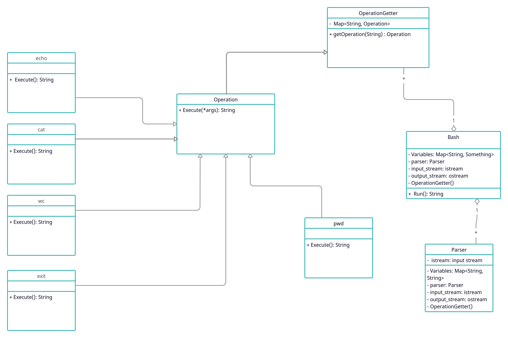

# Bash realization

## Description

The project provides the basic functionality of the bash shell.

The supported commands:

* `echo [STRING]...`
* `pwd`
* `cd [PATH]`
* `ls [PATH]`
* `cat [FILE]...`
* `wc [FILE]...`
* `grep [OPTION]... PATTERN [FILE]...`
    * `-i` - case insensitive
    * `-w` - matches  that whole words
    * `-A [NUM]` - print `NUM`  lines  of  trailing  context  after  matching  lines
* `exit`

Also supported operations:
* Variable assignment: `v=1...`
* Variable dereference: `$v`
* Pipeline: `[OPERATION] | ... | [OPERATION]`
* Double and single quotes
* External operations (executed in real terminal)

## Start

Execute `python3 -m src.main` from project root directory.

## Examples

1.
```
Bash is started. Welcome back, sir/madame!
>>> echo cats
cats
>>> x=4
>>> echo $x | cat
4
>>> exit
Bash is terminated. Good day, sir/madame!
```

2.
```
Bash is started. Welcome back, sir/madame!
>>> x=3 y=4
>>> echo '$x'
$x
>>> echo "$x"
3
>>> exit
Bash is terminated. Good day, sir/madame!
```

## Requirements

Python 3 is used in the project.

Other requirements specified in the `requirements.txt`.


## Test execution

Execute `pytest` from project root directory.


## Architecture scheme

Class `Bash` accepts input string and sends it to the `Parser`.
`Parser` splits it into pipes, where each pipe consists of command and its arguments.
The pipeline is returned to `Bash`, which executes it using `OperationExecutor`.


